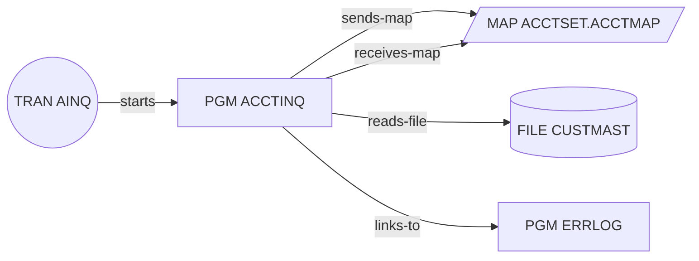
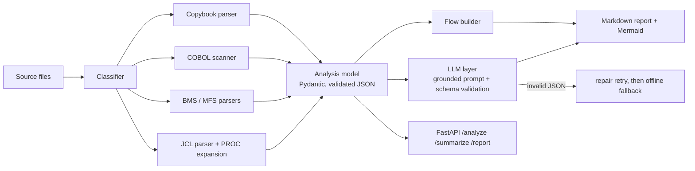

# LegacyLens

**Turn mainframe COBOL, copybooks, CICS BMS screens, IMS MFS formats and JCL into structured JSON, transaction-flow diagrams and LLM-grounded comprehension documents.**

[](https://github.com/AadityaPatil2003/legacy-lens/actions/workflows/ci.yml)
 

Banks, insurers, telcos and governments still run core systems on COBOL, CICS and IMS. Before anything can be modernised, someone has to work out what the code actually does. LegacyLens automates the first pass: deterministic parsers extract the facts (record layouts, screens, file I/O, call graphs, job steps), and an LLM explains the business logic, working **only from those extracted facts plus the source**, with its output validated against a schema.

> All sample programs in `samples/` are synthetic and written for this demo. The approach mirrors professional work I did on mainframe comprehension; no employer or client code is included.

## What it extracts

| Artefact | Parser output |
|---|---|
| **Copybooks** (`.cpy`) | Field tree with PIC, USAGE (DISPLAY / COMP / COMP-3), byte offsets and lengths, OCCURS, REDEFINES, level-88 condition names |
| **COBOL programs** (`.cbl`) | PROGRAM-ID, COPY members, FILE-CONTROL, paragraphs with PERFORM/CALL edges, every `EXEC CICS` command with its options and paragraph, `EXEC SQL` count |
| **CICS BMS** (`.bms`) | Mapsets, maps, fields with row/column/length/attributes, input vs protected fields, literals |
| **IMS MFS** (`.mfs`) | Device format fields (DFLD) and input/output message definitions (MSG/MFLD) |
| **JCL + PROCs** (`.jcl`, `.proc`) | Jobs, steps, programs, DD datasets and dispositions, COND, in-stream data, **PROC expansion with symbolic substitution** (`&ENV..LOADLIB` → `PROD.LOADLIB`) |
| **Flows** | Online flows (transaction → program → map / file / LINK) and batch flows (job → step → program → datasets), rendered as Mermaid |

## Example

```bash
pip install -e ".[dev]"
legacylens analyze samples --out output          # offline, no LLM needed
LEGACYLENS_LLM=ollama legacylens analyze samples  # local LLM via Ollama
```

Excerpt from the generated [`examples/output/REPORT.md`](examples/output/REPORT.md):



Business rules recovered from the batch interest program:

```
WS-INTEREST is calculated as CUST-BALANCE * WS-RATE-RETAIL (constants: WS-RATE-RETAIL = .0125)
WS-INTEREST is calculated as CUST-BALANCE * WS-RATE-BUSINESS (constants: WS-RATE-BUSINESS = .0095)
Condition checked: CUST-BALANCE > CUST-CREDIT-LIMIT
```

## Architecture



Key design decisions are written up in [`docs/architecture.md`](docs/architecture.md).

## API

```bash
uvicorn legacylens.api:app --reload      # or: docker compose up
curl -F files=@samples/cobol/ACCTINQ.cbl -F files=@samples/copybooks/CUSTREC.cpy \
     "http://localhost:8000/summarize?llm=offline"
```

| Endpoint | Returns |
|---|---|
| `GET /health` | status and version |
| `POST /analyze` | structured analysis JSON |
| `POST /summarize?llm=offline\|ollama\|openai` | analysis plus validated per-program summaries |
| `POST /report` | Markdown comprehension document |

Interactive docs at `http://localhost:8000/docs`.

## LLM providers

| `LEGACYLENS_LLM` | Uses | Notes |
|---|---|---|
| `offline` (default) | rule-based summariser | deterministic, used in CI |
| `ollama` | `OLLAMA_URL`, `LEGACYLENS_MODEL` (default `llama3.1`) | fully local; `docker compose --profile llm up` |
| `openai` | any OpenAI-compatible endpoint: `OPENAI_BASE_URL`, `OPENAI_API_KEY` | JSON mode |

## Tests and CI

`pytest` covers every parser (byte offsets, packed-decimal sizes, REDEFINES overlays, PROC substitution), the flow builder, LLM validation and fallback (mocked HTTP) and the API. GitHub Actions runs lint, format, tests on Python 3.10 and 3.12, and a Docker build.

## Limitations and next steps

- The COBOL scanner is regex-based: fine for call graphs and CICS/SQL extraction, not a full grammar (no COPY REPLACING, no nested programs yet).
- Next: DB2 `EXEC SQL` table extraction, Neo4j export of the flow graph, embeddings over paragraphs for RAG-style Q&A across large codebases.

## Author

**Aaditya Patil** · GenAI engineer · Master of Artificial Intelligence, RMIT University
[LinkedIn](https://www.linkedin.com/in/aaditya-patil-50062b245/) · aadityapatil2003@gmail.com
